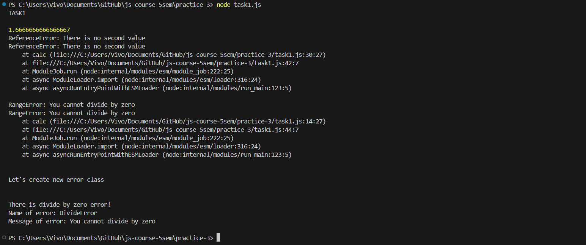
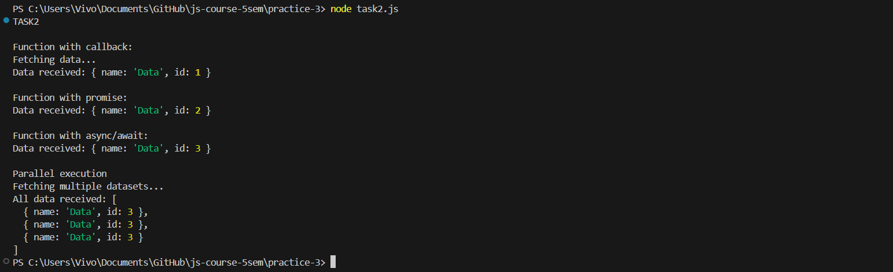
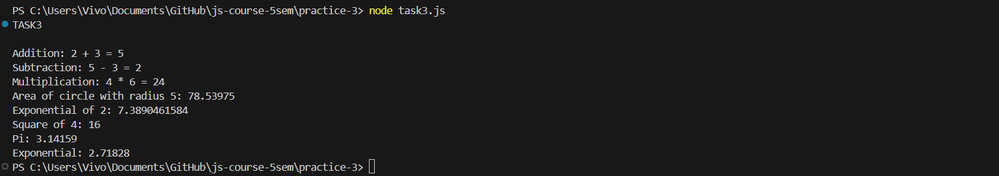

# Интерпретируемый язык программирования высокого уровня
## Практическая работа #3
## Задание 1
Создайте функцию, которая принимает несколько аргументов, выполняет над ними математическую операцию и возвращает ее результат. Реализуйте в ней обработку возможных ошибок с помощью конструкции try...catch, при получении ошибки выведите в консоль информацию о ней, приведите пример использования. Создайте собственный класс ошибки, приведите пример использования.
```javascript
console.log('TASK1');

function calc(a, b, oper) {
    try {
        switch(oper) {
            case '+':
                return a + b;
            case '-':
                return a - b;
            case '*':
                return a * b;
            case '/':
                if (b === 0) {
                    throw new RangeError('You cannot divide by zero');
                }
                else {
                    return a / b;
                }
            case '%':
                if (b === 0) {
                    throw new RangeError('You cannot divide by zero');
                }
                else {
                    return a % b;
                }
            default:
                if (!a) {
                    throw new ReferenceError('There is no first value');
                } else if (!b) {
                    throw new ReferenceError('There is no second value');
                } else {
                    throw new ReferenceError('There is no such operator');
                }
        }
    } catch (err) {
        console.log(`${err.name}: ${err.message}\n${err.stack}`);
    }
};
let res = calc(5, 3, '/');
console.log();
console.log((res !== undefined)? res : ' ');
res = calc(5);
console.log((res !== undefined)? res : ' ');
res = calc(5, 0, '/');
console.log((res !== undefined)? res : ' ');

console.log(`\nLet's create new error class\n\n`);

class DivideError extends Error {
    constructor(message) {
    super(message);
    this.name = 'DivideError';
    this.message = 'You cannot divide by zero';
  }
}

function newCalc(a, b, oper) {
    try {
        switch(oper) {
            case '+':
                return a + b;
            case '-':
                return a - b;
            case '*':
                return a * b;
            case '/':
                if (b === 0) {
                    throw new DivideError();
                }
                else {
                    return a / b;
                }
            case '%':
                if (b === 0) {
                    throw new DivideError();
                }
                else {
                    return a % b;
                }
            default:
                if (!a) {
                    throw new ReferenceError('There is no first value');
                } else if (!b) {
                    throw new ReferenceError('There is no second value');
                } else {
                    throw new ReferenceError('There is no such operator');
                }
        }
    } catch (err) {
        if (err instanceof DivideError) {
            console.log(`There is divide by zero error!\nName of error: ${err.name}\nMessage of error: ${err.message}`);
        } else {
            console.log(`${err.name}: ${err.message}\n${err.stack}`);
        }
    }
};

res = newCalc(1, 0, '/');
console.log((res !== undefined)? res : ' ');
```


## Задание 2
Создайте функцию, которая на вход принимает функцию-колбэк и через несколько секунд возвращает некоторые данные. Используйте функцию-колбэк, чтобы вывести эти данные в консоль после завершения асинхронной операции. Создайте аналогичную функцию с использованием промиса, обработайте успешное и неуспешное выполнение промиса. Создайте аналогичную функцию с использованием синтаксиса async/await, обработайте успешное и неуспешное выполнение функции. Приведите пример параллельного выполнения нескольких асинхронных функций.
```javascript
console.log('TASK2\n');

console.log('Function with callback:');

function fetchDataWithCallback(callback) {
    console.log('Fetching data...');

    setTimeout(() => {
        const data = {name: 'Data', id: 1};
        callback(null, data);
        //callback(new Error('Failed to fetch data'));
    }, 1000);
};

fetchDataWithCallback((error, data) => {
    if (error) {
        console.error('Error:', error.message);
    } else {
        console.log('Data received:', data);
    }
});


setTimeout(() => {
    console.log('\nFunction with promise:');
}, 1500);

let promise = new Promise(function(resolve, reject) {
    setTimeout(() => {
        const data = {name: 'Data', id: 2};
        resolve(data);
        //reject(new Error('Failed to fetch data'))
    }, 2000);
});

promise.then(
    result => console.log('Data received:', result),
    error => console.log('Error:', error.message)
);


setTimeout(() => {
    console.log('\nFunction with async/await:');
}, 2500);

async function fetchData() {
    return new Promise((resolve, reject) => {
        setTimeout(() => {
            const data = { name: "Data", id: 3 };
            resolve(data);            
            //reject(new Error('Failed to fetch data'));
        }, 3000);
    });
};

async function fetchDataAsync() {
    try {
        const data = await fetchData();
        console.log('Data received:', data);
    } catch (error) {
        console.error('Error:', error.message);
    }
}

fetchDataAsync();


async function fetchMultipleData() {
    console.log('Fetching multiple datasets...');

    const fetchData1 = fetchData();
    const fetchData2 = fetchData();
    const fetchData3 = fetchData();

    try {
        const results = await Promise.all([fetchData1, fetchData2, fetchData3]);
        console.log('All data received:', results);
    } catch (error) {
        console.error('Error while fetching data:', error.message);
    }
};

setTimeout(() => {
    console.log('\nParallel execution');
    fetchMultipleData();
}, 3500);
```


## Задание 3
Создайте модуль, предоставляющий функциональность работы с математическими операциями, реализуйте в нем 6 функций, подключите в него модуль, предоставляющий константы, необходимые для ваших функций. При экспортировании функций и переменных приведите примеры всех видов использования директивы экспорта. Подключите реализованную функциональность в основной модуль и приведите примеры использования. При импортировании функций и переменных приведите примеры всех видов использования директивы импорта.

_task3-constants.js_
```javascript
const pi = 3.14159;
const e = 2.71828;

export {pi, e};
```
_task3-math.js_
```javascript
import { pi, e } from './task3-constants.js';

export function circleArea(radius) {
  return pi * radius * radius;
}

const exp = (x) => e ** x;

function add(a, b) {
  return a + b;
}

function subtract(a, b) {
  return a - b;
}

function multiply(a, b) {
  return a * b;
}

function square(a) {
  return a * a;
}

export default add;
export {exp, subtract, multiply, square};
```
_task3.js_
```javascript
import add, { circleArea, exp, subtract, multiply, square} from './task3-math.js';
import * as constants from './task3-constants.js';

console.log('TASK3\n');
console.log(`Addition: 2 + 3 = ${add(2, 3)}`);
console.log(`Subtraction: 5 - 3 = ${subtract(5, 3)}`);
console.log(`Multiplication: 4 * 6 = ${multiply(4, 6)}`);
console.log(`Area of circle with radius 5: ${circleArea(5)}`);
console.log(`Exponential of 2: ${exp(2)}`);
console.log(`Square of 4: ${square(4)}`);
console.log(`Pi: ${constants.pi}`);
console.log(`Exponential: ${constants.e}`);
```


Для корректной работы программы в корне проекта была выполнена команда ```npm init```, создающая файл package.json, в который была добавлена строчка ```"type":"module"``` для работы системы импортов.