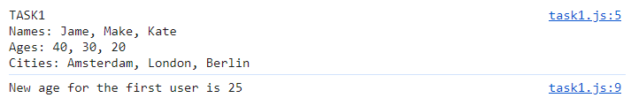
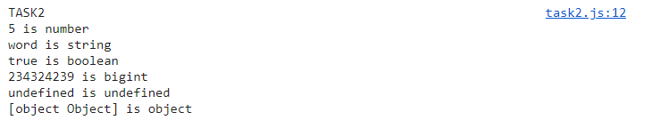
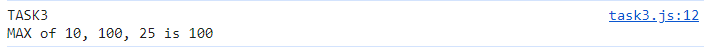
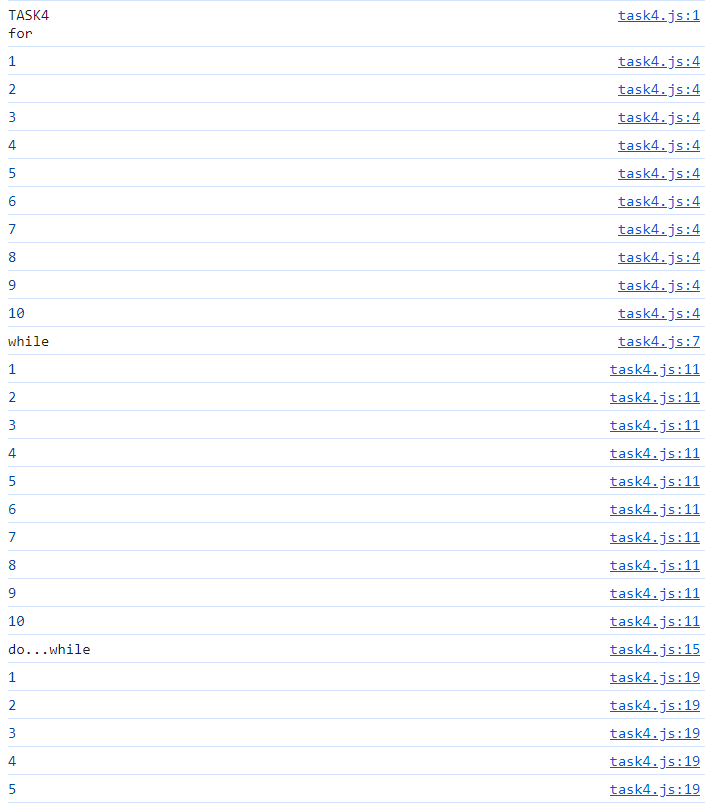
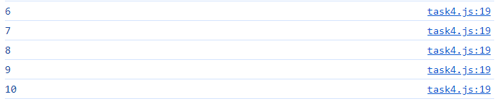
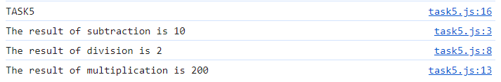

# Интерпретируемый язык программирования высокого уровня
## Практическая работа №1
## Задание 1
Создайте переменные для хранения информации о трех пользователях (имя пользователя, его возраст и город проживания). Используйте различные ключевые слова для определения переменных. Выведите их значения в консоль. Обновите возраст первого пользователя.
```javascript
let name = ['Jame', 'Make', 'Kate'];
let age = [40, 30, 20];
let city = ['Amsterdam', 'London', 'Berlin'];

console.log(`TASK1\nNames: ${name.join(', ')}\nAges: ${age.join(', ')}\nCities: ${city.join(', ')}`);

age[0] = 25;

console.log(`New age for the first user is ${age[0]}`);
```


## Задание 2
Объявите переменные, имеющие различные типы данных. Выведите в консоль их значения и типы данных, используя оператор typeof.
```javascript
let num = 5;
let str = 'word';
let bool = true;
let bint = 234324239n;
let empty;
let book = {
    title: 'name of a book',
    author: 'someone',
    pages: 100,
};

console.log(`TASK2\n${num} is ${typeof(num)}\n${str} is ${typeof(str)}\n${bool} is ${typeof(bool)}\n${bint} is ${typeof(bint)}\n${empty} is ${typeof(empty)}\n${book} is ${typeof(book)}`);
```


## Задание 3
Напишите программу, которая находит среди трех чисел наибольшее, используя логические условия.
```javascript
let a = 10;
let b = 100;
let c = 25;

let maxnum = a;
if (maxnum < b) {
    maxnum = b;
} else if (maxnum < c) {
    maxnum = c;
};

console.log(`TASK3\nMAX of ${a}, ${b}, ${c} is ${maxnum}`);
```


## Задание 4
Напишите программу, которая выводит числа от 1 до 10 с помощью различных циклов: while, do…while, for.
```javascript
console.log('TASK4\nfor');

for (let i = 1; i < 11; i++) {
    console.log(i);
};

console.log('while');

let n = 1;
while (n < 11) {
    console.log(n);
    n += 1;
};

console.log('do...while');

let m = 1;
do {
    console.log(m);
    m += 1;
} while (m < 11);
```



## Задание 5
Создайте функцию, которая принимает два аргумента, выполняет над ними математическую операцию и возвращает ее результат. Используйте три различных синтаксиса описания функции.
```javascript
const sub = function(a, b) {
    let res = a - b;
    console.log(`The result of subtraction is ${res}`);
};

const div = (a, b) => {
    let res = a / b;
    console.log(`The result of division is ${res}`);
};

function mult(a, b) {
    let res = a * b;
    console.log(`The result of multiplication is ${res}`);
}

console.log('TASK5')
sub(20, 10);
div(20, 10);
mult(20, 10);
```
